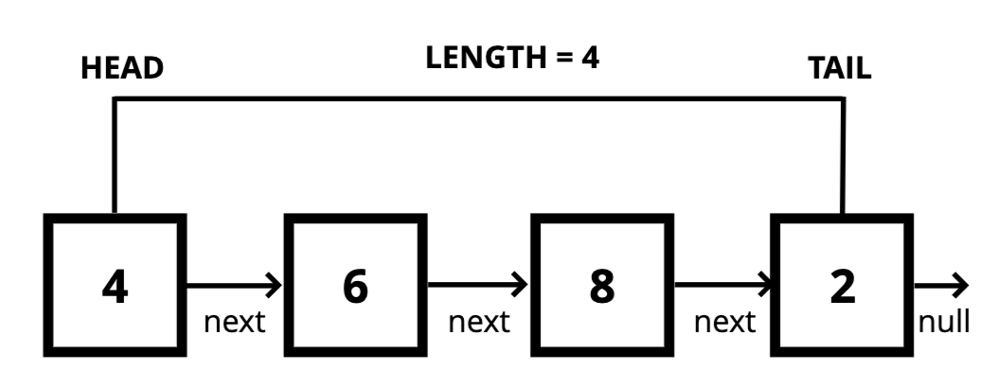

## Data Structure
- Data structure is a way pf organizing and storing data in a computer so that it can be accessed and used efficiently. It refers to logical or mathematical representation of data as well as the implementation in a computer program.
- The data structures populate in javascript are array, and object
    - An array is a collection of items stored at memory locations
        ```
        const arr = [1, 2, 3, 4]
        ```
    - Object in Javascript is a collection of key-value pairs. This data structure is also called map, dictionary, or hash table in other programming language
        ```
        const object = {
            name: 'test',
            profile: {
                address: 'Asia',
                age: 33,
                ....
            }
        }
        ```
#### Singly Linked Lists
- Whats a singly linked list
    - A data structure that contains a head, a tail and length property. Linked lists consist a nodes, each node has a value and a pointer to another node or null
    
- Comparison Lists with Arrays
    - Lists
        - Do not have indexes
        - Connected via nodes with a next pointer
        - Random access is not allowed
    - Arrays
        - Indexed in order
        - Insertion and selection can be expensive
        - Can quickly be accessed at a specific index

#### Stack
- What's Stack
    - Stack is a linear data structure that follows a particular order in which the operation are performed. The order may be LIFO ( Last In First Out ) or FILO ( First In Last Out). Stack used to store information in the form of a list. They allow only adding, and removing elements under a LIFO pattern. In stack, can't be added or removed out of order, they always have to follow the LIFO pattern
    
    https://www.geeksforgeeks.org/stack-data-structure/
- There's more than one way to implement a stack, but probably the simplest is using an array with its push and pop methods. In javascript use the stack for JavaScript's call stack feature. Managing function invocations in various programming languages
- In big O
    - Insertion - O(1)
    - Removal - O(1)
    - Searching - O(n)
    - Access - O(n)

#### Queue
- What's Queue
    - A queue is defined as linear data structure that is open at both ends and the operations are performed in First in First out (FIFO) order
    - Queue works in very similar way to stack, but elements follow a different pattern for add or removal with FIFO.
    - Some examples of queue usage are:
        - background tasks
        - Task processing
    - If we only using push or shift for adding and deleting elements, we'll always follow the FIFO pattern and operate over it like a queue
    
    https://www.geeksforgeeks.org/queue-data-structure/?ref=lbp
- In Big O that it following:
    - Insertion - O(1)
    - Removal - O(1)
    - Searching - O(n)
    - Access - O(n)