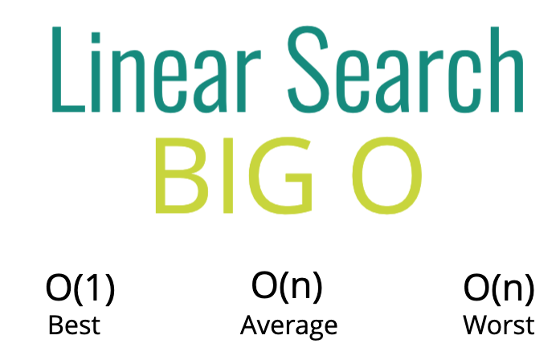
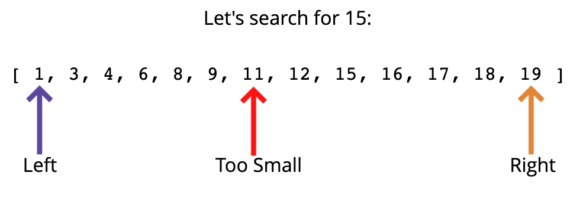
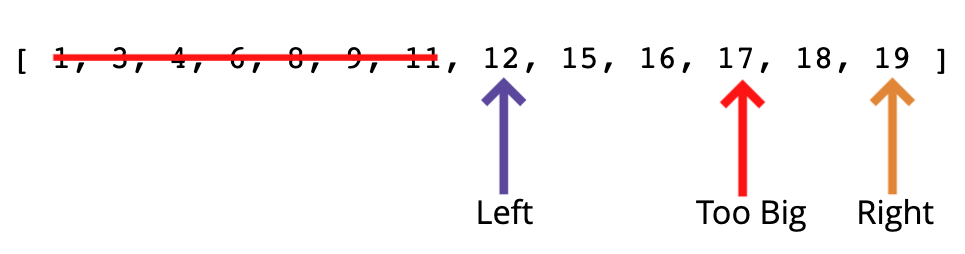
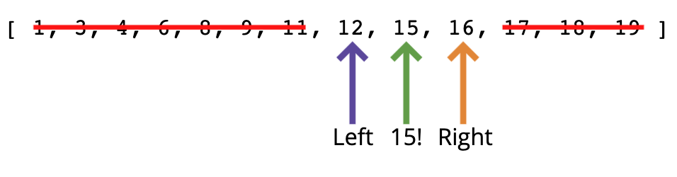
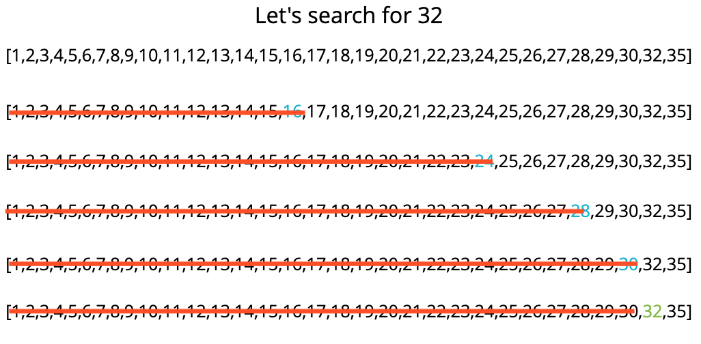

#### SEARCH ALGORITHMS
- In computer science, a search algorithm is an algorithm designed to solve a search problem. Search algorithms work to retrieve information stored within particular data structure, or calculated in the search space of a problem domain, with either discrete or continuous values
- Objectives
    - Implement linear search on arrays
    - Implement binary search on sorted arrays
    - Implement a naive string searching algorithm
    - Implement the KMP string searching algorithm
- How do we search
    - Given an array, The simplest way to search for a value is to look at every element in the array and check the condition if the value we want to
    - In Javascript support many different functions to search element in array
        - includes
        - indexOf
        - find
        - findIndex
        - filter

##### LINEAR SEARCH - O(n)
- This function accepts an array and a value. Loop through the array and check if the current array element is equal to the value If it is, return the index at which the element is found If the value is never found, return -1

- Big O

##### BINARY SEARCH - O(log n)
-  Binary Search is defined as a searching algorithm used in a sorted array by repeatedly dividing the search interval in half
    - Binary search is faster than from of search. And rather than eliminating one element at a time, you can eliminate half of the remaining elements at the time and it's work with sorted array
    - Example:
        - Divide and Conquer
        - Firstly, we have a array include elements, and we need to search and get value we want to
        
        And then we're going to pick value is 11 here. I know we're picking 11 and we check is 15 greater than 11 or less than 11 and it's greater than so.
        
        - Now we eliminate all of that to the left and we make the new left 12 and the new right is the same. It's 19 now.
        
        - And we check is 15 greater than or less than 17 is it on the right side or the left side and. It's on the left side so we can eliminate 17, 18, 19, and now we have a left at 12, a right at 16,and then the middle is 15, which is our only choice.
    - Notice:
        - When we use the binary search and remember the function accepts a sorted array and a value
        - Create a left pointer at the start of the array, and a right pointer at the end of the array
        - While the left pointer comes before the right pointer:
            - Create a pointer is middle, If you find the value you want re turn the index, or if the value is too small, move the left pointer up
    - Example 2:
        
        - Or actually we didn't find the element, but it took maximum four steps here. We doubled it to 32 elements and it took a maximum of five steps to find our element. So that relationship is log base two of MN. So every time we double the size of N, every time we double it, we are simply adding one extra step.
        - O(log n), O(1)

##### NAIVE STRING SEARCH - O(nm)
- Slide the pattern over text one by one and check for a match. If a match is found, then slide by 1 again to check for subsequent matches
    - Loop over the longer string
    - Loop over the shorter string
    - If the characters don't match, break out of the inner loop
    - If the characters do match, keep going
    - If you complete the inner loop and find a match, increment the count of matches
    - Return the count
    