## SORT ALGORITHMS
- what is sorting ?
    - Sorting is the process of rearranging the items in a collection (e.g. an array) so that the items are in some kind of order
    - Examples:
        - Sorting numbers from smallest to largest
        - Sorting names alphabetically
        - Sorting movies based on release year
        - Sorting movies based on revenue
- Comparison which the srt algorithms fastest
    - https://www.toptal.com/developers/sorting-algorithms/nearly-sorted-initial-order
#### BUBBLE SORT
- Bubble Sort is the simplest sorting algorithm that works by repeatedly swapping the adjacent elements if they are in the wrong order. This algorithm is not suitable for large data sets as its average and worst-case time complexity is quite high.
    -  Start looping from with a variable called i the end of the array towards the beginning
    - Start an inner loop with a variable called j from the beginning until i - 1
    - If arr[j] is greater than arr[j+1], swap those two values!. Return the sorted array
    - https://www.geeksforgeeks.org/bubble-sort/
    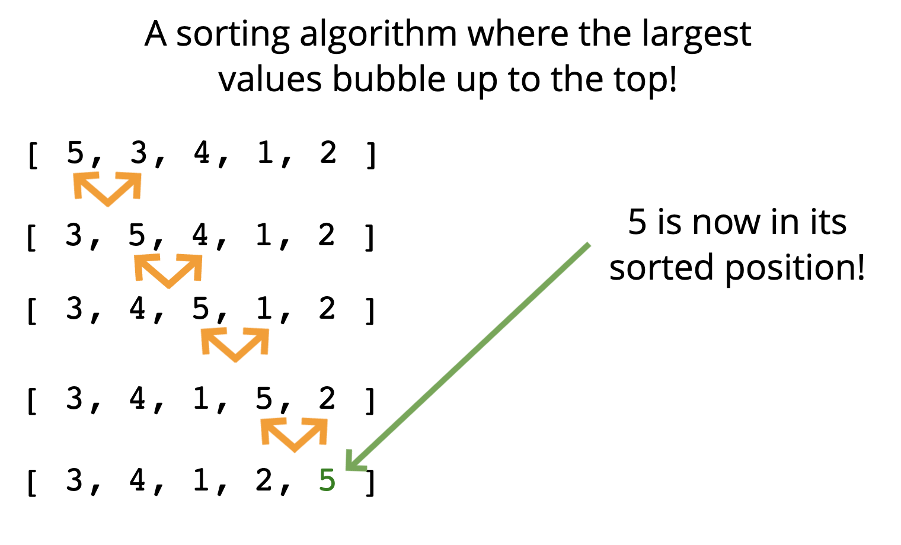

#### SELECTION SORT
- Selection sort is a simple and efficient sorting algorithm that works by repeatedly selecting the smallest (or largest) element from the unsorted portion of the list and moving it to the sorted portion of the list. The algorithm repeatedly selects the smallest (or largest) element from the unsorted portion of the list and swaps it with the first element of the unsorted part. This process is repeated for the remaining unsorted portion until the entire list is sorted. 
- Similar to bubble sort, but instead of first placing large values into sorted position, it places small values into sorted position
- https://www.geeksforgeeks.org/selection-sort/
- Use case:
    - Store the first element as the smallest value you've seen so far.
    - Compare this item to the next item in the array until you find a smaller number.
    - If a smaller number is found, designate that smaller number to be the new "minimum" and continue until the end of the array.
    - If the "minimum" is not the value (index) you initially began with, swap the two values.
    - Repeat this with the next element until the array is sorted.
    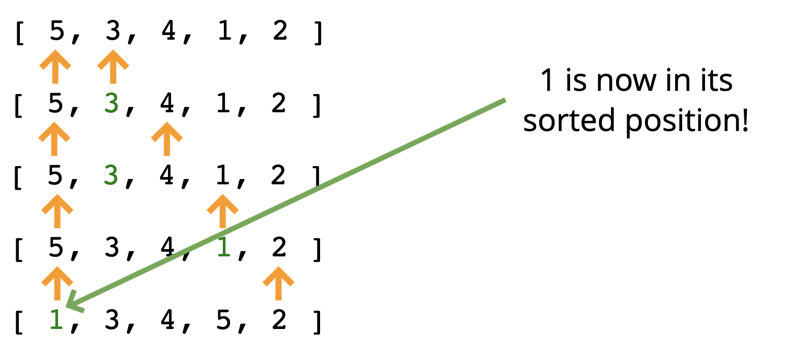

#### INSERTION SORT
- Insertion sort is a simple sorting algorithms that works similar to the way you sort playing cards in your hands. The array is virtually split into a sorted and an unsorted part. Values from the unsorted part are picked and placed at the correct position in sorted part.
    - Start by picking the second element in the array
    - Now compare the second element with the one before it and swap if necessary.
    - Continue to the next element and if it is in the incorrect order, iterate through the sorted portion (i.e. the left side) to place the element in the correct place.
    - Repeat until the array is sorted.
    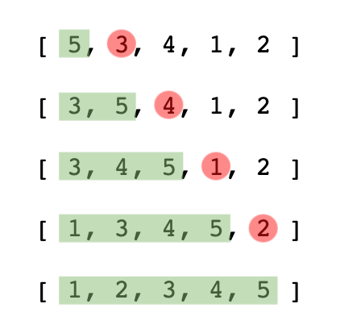

#### MERGE SORT
- Merge sort is defined as a sorting algorithm that works by dividing an array into smaller subarrays, sorting each subarray, and then merging the sorted subarrays back together to form the final sorted array.
    - There is a family of sorting algorithms that can improve time complexity from O(n) to O(n log n) . There's a tradeoff between efficiency and simplicity. The more efficient algorithms are much less simple, and generally take longer to understand
    - It's a combination of two things - merging and sorting!
    - Exploits the fact that arrays of 0 or 1 element are always sorted
    - Works by decomposing an array into smaller arrays of 0 or 1 elements, then building up a newly sorted array
- How does Merge Sort work?
    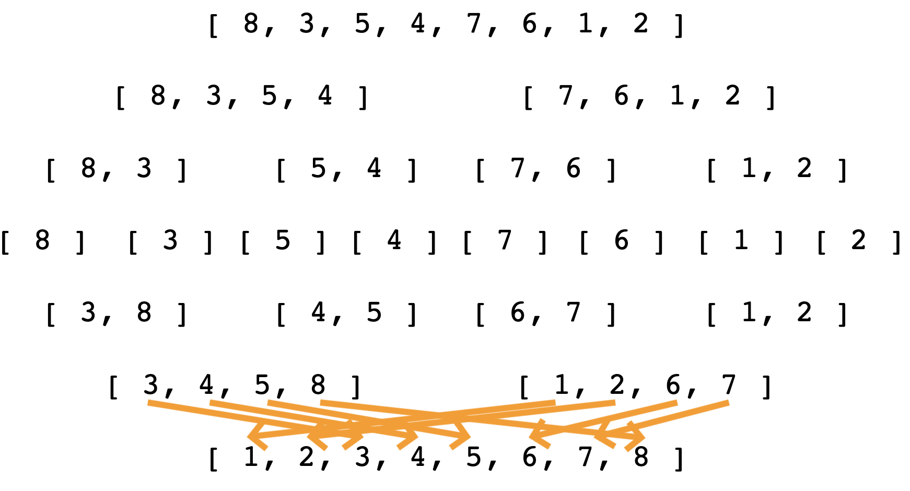

#### QUICK SORT
- QuickSort is a sorting algorithm based on the [Divide and Conquer algorithm](https://www.geeksforgeeks.org/introduction-to-divide-and-conquer-algorithm-data-structure-and-algorithm-tutorials/) that picks an element as a pivot and partitions the given array around the picked pivot by placing the pivot in its correct position in the sorted array.
    - Like merge sort, exploits the fact that arrays of 0 or 1 element are always sorted
    - Works by selecting one element (called the "pivot") and finding the index where the pivot should end up in the sorted array
    - Once the pivot is positioned appropriately, quick sort can be applied on either side of the pivot
    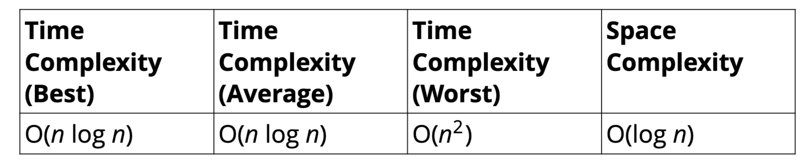
- https://www.geeksforgeeks.org/quick-sort/
- How does QuickSort work?

Best case
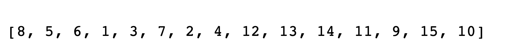
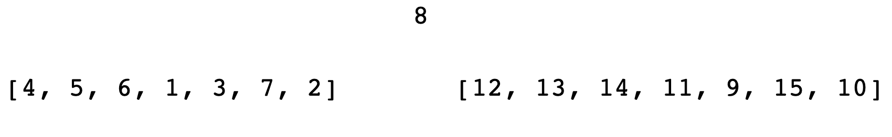
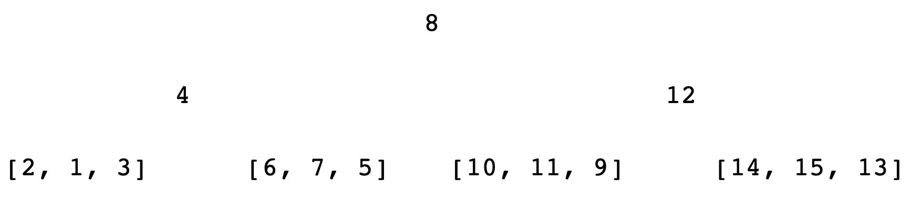

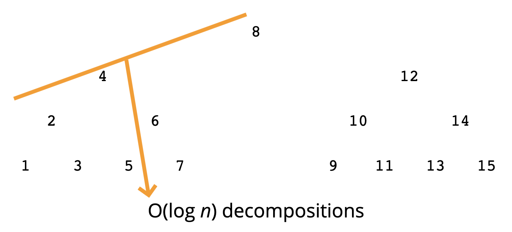
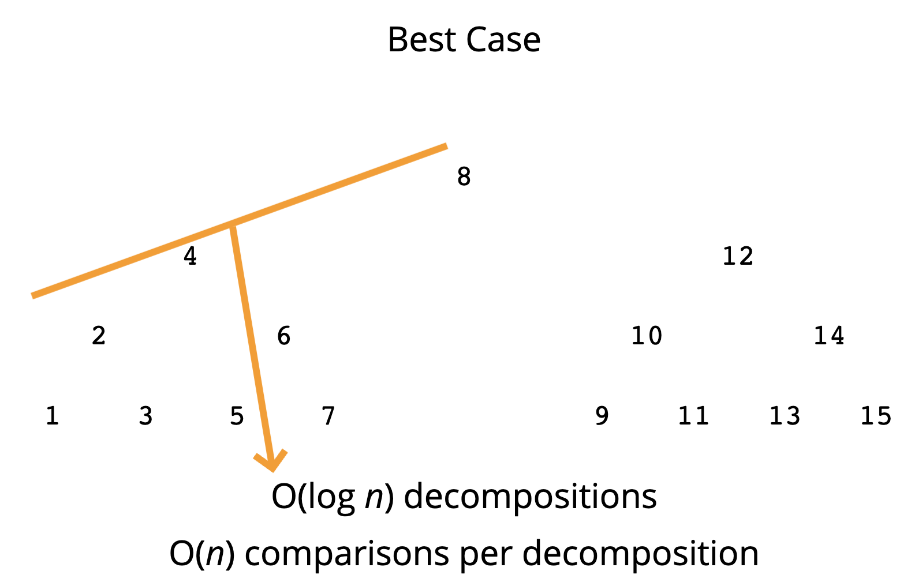

Worst case
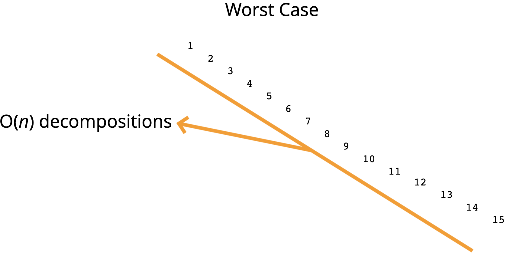

#### RADIX SORT
- Radix Sort is a linear sorting algorithm that sorts elements by processing them digit by digit. It is an efficient sorting algorithm for integers or strings with fixed-size keys. 
- Radix sort is a special sorting algorithm that works on lists of numbers. It never makes comparisons between elements! It exploits the fact that information about the size of a number is encoded in the number of digits. 
- https://www.geeksforgeeks.org/radix-sort/
- How does it work?
    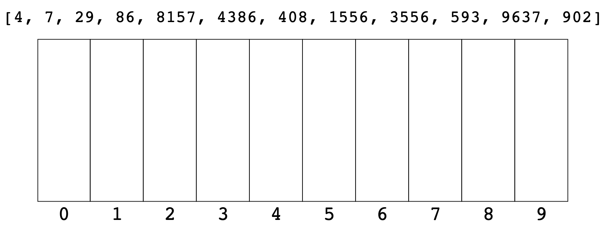
    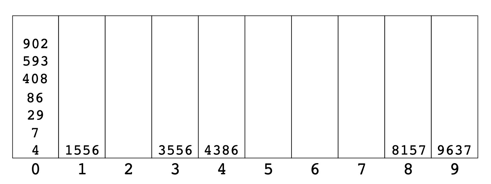
    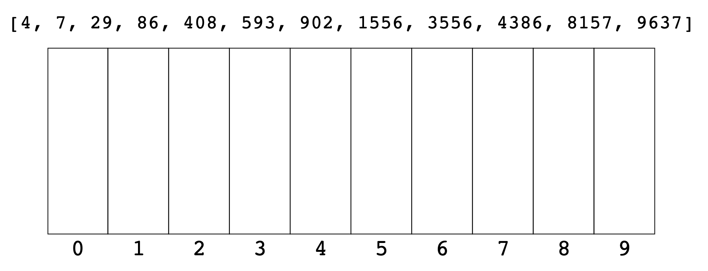
- Big O
    - 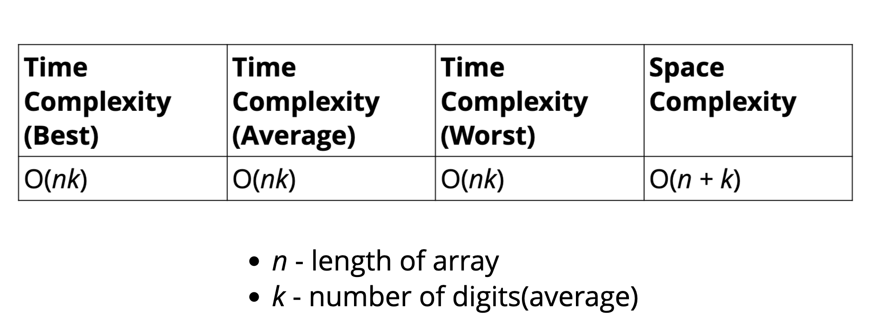

## Summary
- #### Big O of Sorting Algorithms
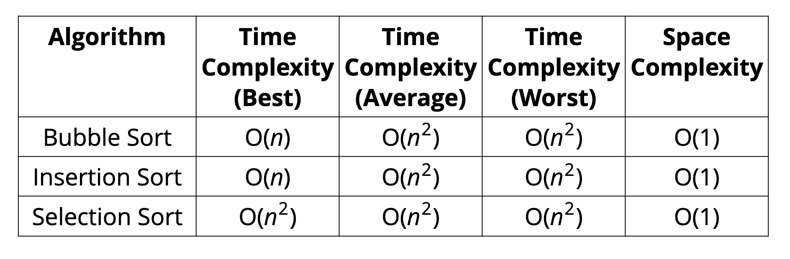
- Bubble sort, selection sort, and insertion sort are all roughly equivalent. All have average time complexities that are quadratic
- Merge sort and quick sort are standard efficient sorting algorithms
- Quick sort can be slow in the worst case, but is comparable to merge sort on average
- Merge sort takes up more memory because it creates a new array (in-place merge sorts exist, but they are really complex!)
- Radix sort is a fast sorting algorithm for numbers